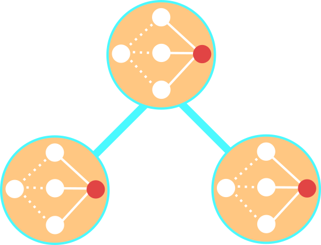

# neural-tree

neural-tree is an implementation of the algorithm developed in the paper [Neural Trees: Using Neural Nets in a Tree Classifier Structure](http://ieeexplore.ieee.org/xpl/login.jsp?tp=&arnumber=150832&url=http%3A%2F%2Fieeexplore.ieee.org%2Fxpls%2Fabs_all.jsp%3Farnumber%3D150832). 

The abstract to the paper by Stromberg, et al. gives a nice introduction to neural trees.

>The concept of tree classifiers is combined with the popular neural net structure. Instead of having one large neural net to capture all the regions in the feature space, the authors suggest the compromise of using small single-output nets at each tree node. This hybrid classifier is referred to as a neural tree.

# Motivation

One reason to use to a neural tree instead of a decision tree (implementing the induction method introduced by Breiman) is when one needs more flexible splitting hyperplanes. 

For example, consider the following case. Suppose one wishes to split the following classes of points: (B)lack and (R)ed, in the xy-plane. 

These two classes are split by the hyperplane: y + 3/5x - 3/4 = 0. Within one step of the neural tree algorithm these classes would be identified. It is not necessarily true for a traditional decision tree splitting over the hyperplanes produced by a single attribute.

# Authors

# Quick Start

Currently there are some package dependencies. These include:

* nnet
* entropy
* caret
* plyr
* parallel

## Initial Setup

Simply load the neural-tree files into your working directory. Then run one of the functions in the samples.R file.